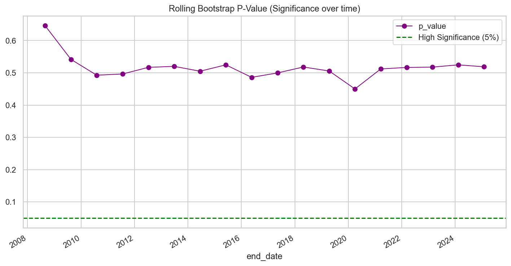

# Strategy Report
**Date:** 2025-12-28 20:39

## 1. Executive Strategy Profile
### 1.1 Mandate & Parameters
- **Simulation Period:** 2000-01-03 to 2025-08-31
- **Initial Capital:** 10,000.00 USD
- **Recurring Inv. (PAC):** 1,000.00 USD (BMS)
- **Rebalancing:** QS
- **Benchmark:** WORLD
### 1.2 Strategic Asset Allocation
- **Core Weight:** 100.0% (Strategic/Static)
- **Satellite Weight:** 0.0% (Tactical/Dynamic)
### 1.3 Universe Composition
**Core Constituents (Policy Weights):**
| Ticker | Weight |
| :--- | :--- |
| VALUE | 25.0% |
| QUALITY | 25.0% |
| MOMENTUM | 25.0% |
| SIZE | 25.0% |

**Satellite Candidates (Dynamic Universe):**
_VALUE, QUALITY, MOMENTUM, SIZE, WORLD_

### 1.4 Signal Engine Configuration
| Signal Factor | Influence Weight |
| :--- | :--- |
| pure_momentum | 20% |
| alpha | 40% |
| valuation | 40% |

## 2. Key Performance Indicators
| Metric | Portfolio | Benchmark |
| :--- | :--- | :--- |
| **CAGR** | 7.60% | 5.91% |
| **Vol (Daily)** | 15.62% | 16.03% |
| **Sharpe** | 0.40 | 0.29 |
| **Sortino** | 0.63 | 0.45 |
| **Max DD** | -58.15% | -57.76% |
| **Calmar** | 0.13 | 0.10 |
| **Skew** | -0.48 | -0.38 |

## 3. Relative Performance
| Metric | Value |
| :--- | :--- |
| **Alpha (Ann)** | 1.76% |
| **Beta** | 0.96 |
| **Info Ratio** | 0.50 |
| **Track Err** | 2.96% |

## 4. Periodic Returns
|                 | Portfolio   | Benchmark   |
|:----------------|:------------|:------------|
| YTD             | 14.99%      | 13.78%      |
| 1 Month         | 2.50%       | 1.54%       |
| 3 Months        | 8.23%       | 8.93%       |
| 1 Year          | 14.83%      | 16.65%      |
| 3 Years         | 16.10%      | 17.51%      |
| 5 Years         | 11.62%      | 12.89%      |
| Since Inception | 599.91%     | 359.89%     |

## 5. Annual Returns
|   Date | Portfolio   | Benchmark   |
|-------:|:------------|:------------|
|   2000 | -7.97%      | -13.80%     |
|   2001 | -9.86%      | -16.93%     |
|   2002 | -15.81%     | -19.90%     |
|   2003 | 40.15%      | 32.85%      |
|   2004 | 21.77%      | 14.60%      |
|   2005 | 16.70%      | 9.44%       |
|   2006 | 21.60%      | 20.03%      |
|   2007 | 11.11%      | 9.02%       |
|   2008 | -40.69%     | -40.68%     |
|   2009 | 32.66%      | 30.00%      |
|   2010 | 15.72%      | 11.69%      |
|   2011 | -4.31%      | -5.51%      |
|   2012 | 15.19%      | 15.80%      |
|   2013 | 29.97%      | 26.66%      |
|   2014 | 4.83%       | 4.95%       |
|   2015 | 0.77%       | -0.88%      |
|   2016 | 7.55%       | 7.50%       |
|   2017 | 24.96%      | 22.39%      |
|   2018 | -9.41%      | -8.71%      |
|   2019 | 25.96%      | 27.67%      |
|   2020 | 14.28%      | 15.90%      |
|   2021 | 18.24%      | 21.80%      |
|   2022 | -16.65%     | -18.15%     |
|   2023 | 18.03%      | 23.78%      |
|   2024 | 15.27%      | 18.67%      |
|   2025 | 14.99%      | 13.78%      |

## 6. Visual Analysis
### Growth & Risk

### Rolling Analysis (Dynamic)

### Allocation & Seasonality

# 7. Advanced Statistical Validation
## 7.1 Probabilistic Metrics (Lopez de Prado)
- **Probabilistic IR (P[IR>0]):** 99.58%
- **Min Track Record (95% Conf.):** 10.4 Years

## 7.2 Bootstrap Reality Check (Non-Centered - Robustness)
- **Observed t-stat:** 2.611
- **Prob(t* > 0):** **99.74%**
- **Interpretation:** **STRUCTURAL EDGE CONFIRMED:** The strategy (or its underlyings) generates positive returns in >95% of random scenarios. The engine is robust.

## 7.3 BRC Centered (Skill vs Luck)
- **Centered t-stat:** -0.276
- **Prob(t* > 0) [Skill Mass]:** **50.07%**
- **Interpretation:**  **NO TIMING SKILL:** Value comes from index selection, not Timing.

## 7.4 Rolling Time Robustness
### Rolling Probability of Positive Return

### Rolling P-Value (Outlier Check)

